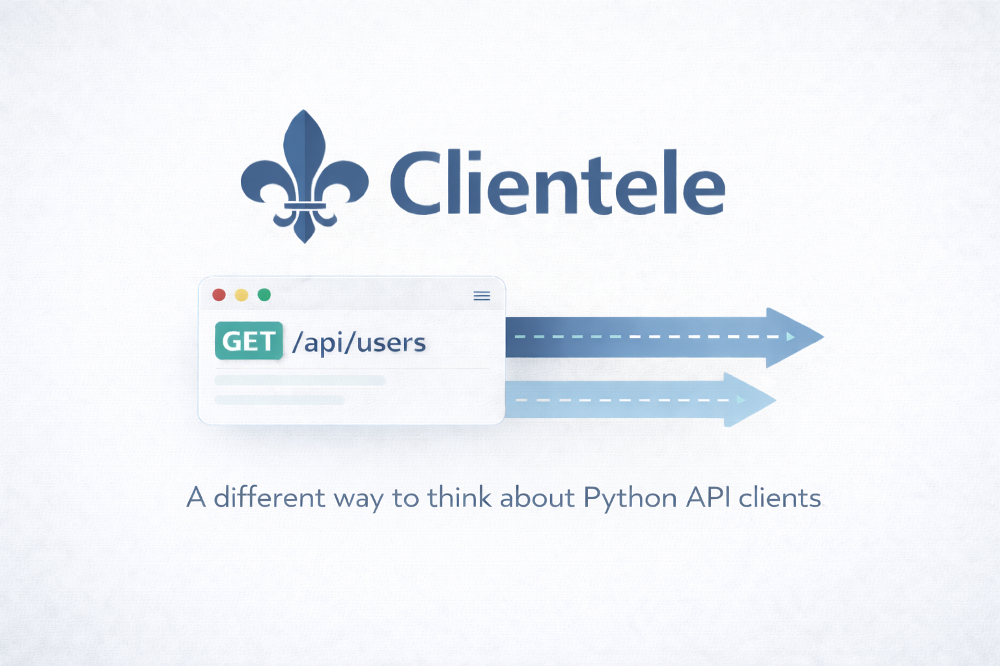

# 



<div style="text-align: center;">
<p>
    <a href="https://pypi.org/project/clientele">
    
    </a>
    
    
    <a href="https://codecov.io/github/phalt/clientele">
    
    </a>
    <a href="https://pepy.tech/projects/clientele">
    
    </a>
</p>
<p>
    
    
</p>
</div>

## Example code

```python
from clientele import api
from pydantic import BaseModel

client = api.APIClient(base_url="https://pokeapi.co/api/v2/")

class Pokemon(BaseModel):
    name: str

@client.get("/pokemon/{id}")
def get_pokemon_name(id: int, result: Pokemon) -> str:
    return result.name
```

[See more examples](https://docs.clientele.dev/api-examples/)

## Why use Clientele?

- **A comfortable abstraction** - Encourages consistency and focus on the functionality.
- **Easy to learn** - Clientele is visually similar to popular python API server frameworks.
- **Easy to test** - Comes with built-in testing tools, and works with existing libraries like [respx](https://lundberg.github.io/respx/) and [pytest-httpx](https://pypi.org/project/pytest-httpx/).
- **Easy to configure** - Clientele has sensible defaults and plenty of hooks for customisation.
- **Easy data validation** - Built in data validation using [Pydantic](https://docs.pydantic.dev/latest/).
- **Use your own HTTP** - Clientele can support all HTTP libraries.
- **OpenAPI support** - Build your own client, or scaffold one from an OpenAPI schema.

## Async support

```python
@client.get("/pokemon/{id}")
async def get_pokemon_name(id: int, result: Pokemon) -> str:
    return result.name
```

## Automatic data validation

```python
from clientele import api as clientele_api
from .my_pydantic_models import CreateBookRequest, CreateBookResponse

client = clientele_api.APIClient(base_url="http://localhost:8000")


@client.post("/books")
def create_book(data: CreateBookRequest, result: CreateBookResponse) -> CreateBookResponse:
    return result
```

## Streaming responses

```python
from typing import AsyncIterator

from clientele import api
from pydantic import BaseModel


client = api.APIClient(base_url="https://httpbin.org")


class Event(BaseModel):
    id: int
    url: str


@client.get("/stream/{n}", streaming_response=True)
async def stream_events(n: int, result: AsyncIterator[Event]) -> AsyncIterator[Event]:
    return result
```

## Direct requests

```python
result = client.request(
    "GET", 
    "pokemon/{pokemon_id}", 
    response_map={200: Pokemon}, 
    pokemon_id=1
)
```

## Works with Python API frameworks

Built and tested to be 100% compatible with the OpenAPI schemas generated from:

- **FastAPI**
- **Django REST Framework** via **drf-spectacular**
- **Django Ninja**

See the working demos in our [`server_examples/`](https://github.com/phalt/clientele/tree/main/server_examples) directory.

## OpenAPI support

Clientele can create scaffolding for an API client from an OpenAPI schema with:

- **Pydantic models** generated from the schema objects.
- **Decorated function signatures** generated from schema operations.
- **Async support** if you want a client with concurrency.
- **A tiny output** that is only 3 files big.
- **Regeneration-friendly** - update your API, regenerate, review the git diff, then ship it!
- **Formatted code** thanks to [Ruff](https://docs.astral.sh/ruff/).


## API Client explorer

Clientele has an `explore` mode for quickly testing and debugging APIs through an interactive REPL:

```sh
# Explore an existing clientele-compatible client
uvx clientele explore -c my_clientele_client/

# Or generate a temporary client from any OpenAPI service on the web
uvx clientele explore -u https://raw.githubusercontent.com/PokeAPI/pokeapi/master/openapi.yml
# 🤫 Pssst! Copy and paste this right now to try it!
```


- **Autocomplete** for operations and schemas.
- **Execute API operations** to test the API.
- **Inspect schemas** to see what the objects look like.
- **Modify configuration** within the REPL as you're testing.
